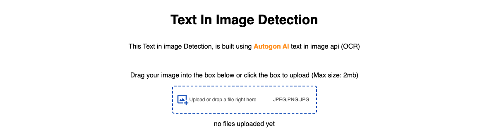

# Text In Image Detection using Autogon AI

>This app is showcasing the Autogon AI power and this can be integrated into any application for text identificatio in images. 

This app was built using react [vite](https://vitejs.dev/guide/), little vanilla css, and [react-drag-drop-files](https://www.npmjs.com/package/react-drag-drop-files) library.

To run this app locally, you need to have an [Autogon](https://autogon.ai/) account, so as to be able to get your API key. If you don't have an existing account, signup, and log in to your dashboard, click your profile image, then click on settings, you'd find the tab for API, generate your API key and come back to your code for usage.

At the root level of your app (that is, the same location where your `vite.config.js` is located), create a `.env` file and put your API key there for safety.

>the `sample.env` file is there to guide you on what is needed
>base url is `https://api.autogon.ai/api/v1`

---

Once you clone this repo, change your directory into the folder, open your terminal, either through your coding environment or your default system based (cmd, terminal). Run `npm install`, and `npm run dev` in the terminal respectively and your app should be running.

:bulb: upload an image with text, and click `analyze image`.

> the code also has comment, so it easier to understand